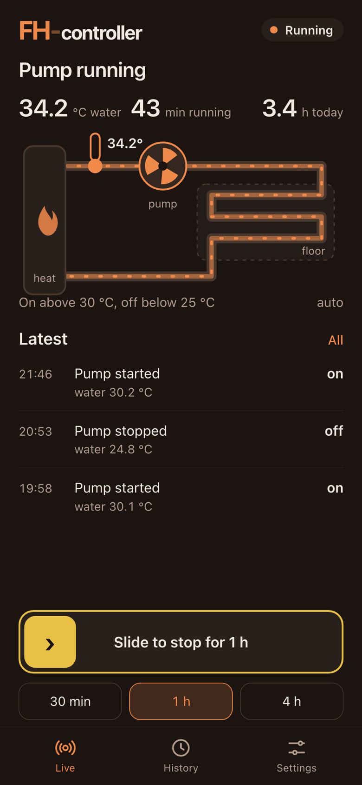
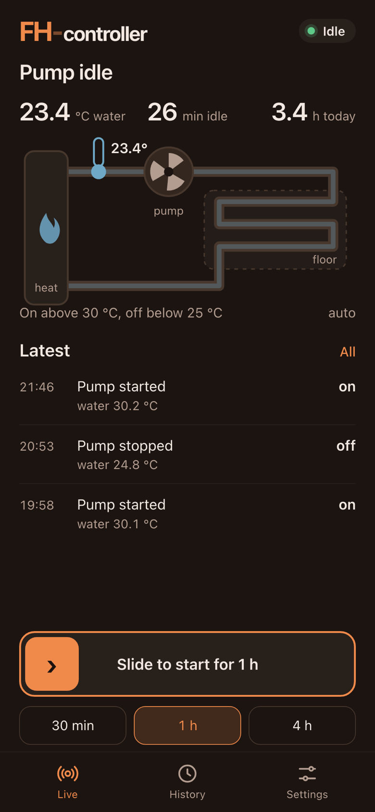
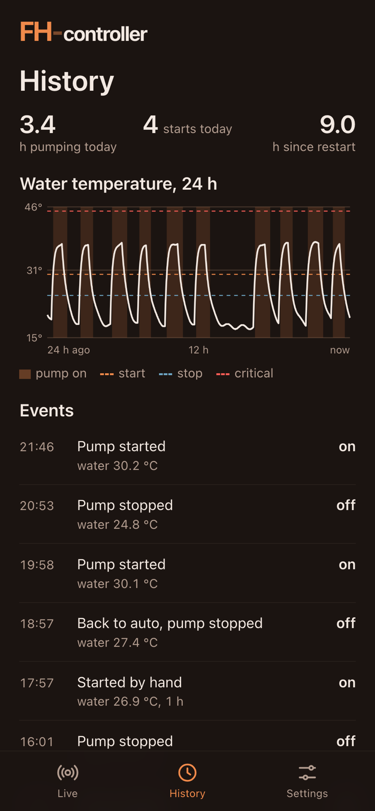
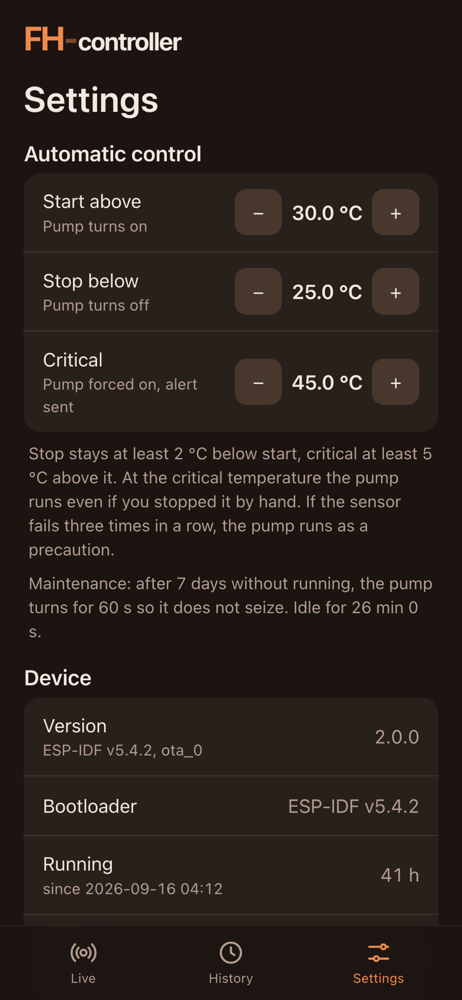
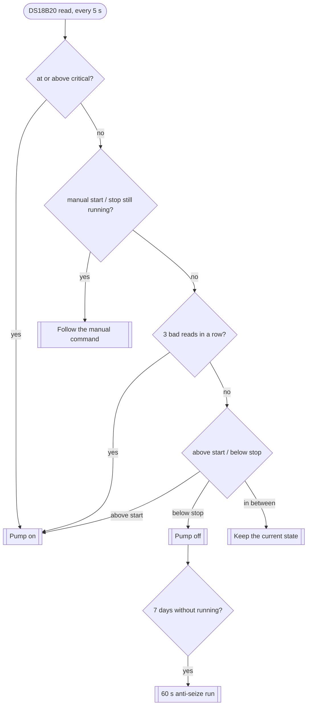

# floor-heating-controller

**ESP32 controller for the underfloor heating pump: it runs the pump only while the supply pipe is warm enough to
heat the floor, and keeps doing that when the network, the server and the phone are gone.**

One DS18B20 on the supply pipe, one relay for the circulation pump. Above the start threshold the pump runs, below
the stop threshold it stops, and a few rules on top of that hysteresis keep the floor from being heated with cold
water, the pump from seizing over the summer and the house from ignoring an overheated circuit. In production for
2+ years; the current firmware 2.x was installed over the air, without opening the box.

<p align="center">
  
  
  
  
</p>

<p align="center"><sub>The web app the device serves, rendered with sample data (<code>tools/screenshots.py</code>).</sub></p>

## What it does

- **Hysteresis control**: the pump runs above the start threshold and stops below the stop one (defaults 30 °C and
  25 °C, set from the app, stored in NVS). Nothing else decides when the pump runs.
- **Overheat protection**: at the critical temperature (default 45 °C) the pump is forced on, a manual stop is
  dropped and an alert goes out. It clears 2 °C below critical.
- **Sensor fail-safe**: three bad reads in a row (an error or the DS18B20's 85.0 °C power-on value) and the pump runs
  until the sensor answers again, so a dead sensor never leaves a hot circuit standing still.
- **Manual start and stop** for 1 min to 12 h (the app offers 30 min, 1 h, 4 h), then back to automatic on its own.
- **Maintenance run**: after 7 idle days the pump turns for 60 s, so the impeller does not seize over the summer.
- **App** for phone, tablet and desktop: a live scheme of the loop, the water temperature, how long the pump has been
  in its current state, a 24 h chart with pump-on spans, the last 50 events, the thresholds and device health.
- **Push notifications** ([ntfy](https://ntfy.sh)): pump start and stop on one topic, overheat, sensor failure and
  every error line on another.
- **Safe over-the-air updates**: a new image is verified after the first boot and rolled back if it misbehaves.

## Control rules

The control task is the product. It runs on core 1 under the task watchdog, reads the sensor every 5 s, and is the
only code in the firmware that touches the relay. It never calls the network and never waits on a queue: events and
notifications are handed over without blocking, so Wi-Fi, the web server or ntfy failing cannot change what the pump
does. A reboot returns to automatic control with the pump off for the first read (under a second).



The decisions live in `control_logic.c`, which has no ESP-IDF includes at all and is covered by host tests
(`firmware/test`, run in CI). The task around it only supplies readings and a clock and drives the GPIO.

| Rule | Comes from | Wins over |
|---|---|---|
| Overheat | the temperature alone | everything, including a manual stop |
| Manual start / stop | the app or `/admin/pump`, RAM only, expires by itself | the sensor fail-safe and hysteresis |
| Sensor fail-safe | 3 consecutive bad reads | hysteresis |
| Hysteresis | thresholds in NVS, clamped on write | the maintenance run |
| Maintenance run | 7 days idle below the stop threshold | nothing; it stops itself after 60 s |

Thresholds are clamped when they are saved, so no setting can produce a contradictory pair: start 20–60 °C, stop at
least 10 °C and at least 2 °C below start, critical at least 5 °C above start and at most 80 °C.

## Built on home-idf

Everything that is not pump control comes from [home-idf](https://github.com/tomekceszke/home-idf), the component
shared with the water and gate controllers: Wi-Fi that joins the strongest access point, UDP logging, NTP,
HTTPS OTA with a pinned certificate, image verification with rollback, ntfy notifications, web sign-in (PBKDF2
password, sessions in NVS, CSRF and `Origin`/`Host` checks, login back-off) and the HTTP server with its guards.

The app is built on the same shell as the other controllers, so all of them look and behave alike: wordmark and
status pill, headline, three numbers, a main view, the latest events, and a dock with a slide control and chips over
the Live / History / Settings tabs.

The over-the-air migration below is home-idf's `hi_migrator` as well, so the same procedure served the water and
gate controllers first.

## Firmware 2.x, installed over the air

The legacy firmware ran on the stock `two_ota` table: 1 MB slots, no coredump partition, software-only rollback,
and a bootloader built with ESP-IDF 5.4.1. Firmware 2.x is 951 KB, which is 93 % of such a slot, so it needed the
layout the other controllers use: ota_0 2 MB, ota_1 1.875 MB, a coredump partition and the ESP-IDF 5.4.2 bootloader
with native rollback. The board sits in a place where opening it is the last resort.

`migrator/` is a one-shot image that fits the legacy 1 MB slot, carries the new bootloader and table inside itself,
checks everything it can before it commits, writes them, then downloads the real firmware. **The pump is held on for
the whole run**, because the migrator cannot control it: heating a floor for a few minutes too long is harmless,
stopping a hot circuit is not. The production migration took about 100 seconds end to end; the procedure, the
pre-commit checks, the recovery path and the minute-by-minute log are in [docs/IDF5_MIGRATION.md](docs/IDF5_MIGRATION.md).

## Hardware

| Item | Value |
|---|---|
| Module | ESP32-WROOM-32E, 4 MB flash (DIO, 40 MHz) |
| Board | ESP32_Relay_AC X1 V1.1 (303E32AC111), CP2102 USB-UART |
| Sensor | DS18B20 on the supply pipe, GPIO4 (1-Wire) |
| Relay | GPIO16, HIGH = pump on |

USB is the recovery path: hold **IO0**, press and release **EN**, release **IO0**, then flash bootloader, table and
app over serial.

## Repository

```
firmware/     ESP-IDF 5.4.2 firmware 2.x (C): control task and pure control logic, sensor, relay,
              settings, events, 24 h history, HTTP API, app (web/), host tests (test/)
migrator/     one-shot image that moved the legacy device to the 2.x bootloader and partition table
tools/        release build, README screenshots with mocked API data
docs/         migration procedure and production log, README screenshots (img/)
```

## Build

```sh
cp firmware/main/config/credentials-example.h firmware/main/config/credentials.h   # Wi-Fi, password hash, ntfy
# firmware/certs/ota_server_cert_15.pem: the certificate of your OTA server
firmware/build.sh                                  # ESP-IDF 5.4.2
firmware/build.sh -p /dev/cu.usbserial-0001 flash  # over USB, in download mode
cmake -S firmware/test -B build-test && cmake --build build-test && ctest --test-dir build-test
tools/build_release.sh                             # firmware + migrator into releases/ with sha256
```

Passwords are hashed with `home-idf/tools/hash_password.py`, other secrets obfuscated with
`home-idf/tools/obfuscate.py`. Nothing in `credentials.h` or `certs/` is committed. Setup, conventions and device
details: [CLAUDE.md](CLAUDE.md).

## API

Sign-in and the common routes (`/`, `/api/session`, `/api/login`, `/api/reboot`, `/api/ota`, `/admin/hw-status`, …)
come from home-idf. Controller routes:

| Method | Path | Guard | |
|---|---|---|---|
| GET | `/api/status` | session | pump, temperature, today, since boot, thresholds and limits, system |
| GET | `/api/events` | session | the last 50 events |
| GET | `/api/history` | session | 24 h of one-minute samples: temperature and a pump bit per minute |
| POST | `/api/pump` | session + CSRF | `{"state":"start","minutes":60}`, `{"state":"stop","minutes":60}`, `{"state":"auto"}` |
| POST | `/api/settings` | session + CSRF | `{"start_c":30,"stop_c":25,"critical_c":45}`, partial and clamped |
| POST | `/admin/pump` | `Authorization` header | same body as `/api/pump`, for scripts |
| GET | `/admin/status` | `Authorization` header | same as `/api/status` |

A mutation needs a session cookie, a JSON body, a CSRF token and an `Origin` equal to the `Host`. Stopping the pump
while the water is over the critical temperature answers `409 overheat`.

## History

- **Until 2026**: the first firmware: hysteresis, a small web page, ntfy notifications, the maintenance run.
  It kept the floor warm for two heating seasons and never controlled the pump from anywhere but the sensor.
- **2026**: firmware 2.0.0 on home-idf: the pure control logic with host tests, thresholds and events, 24 h history,
  the shared app, and the over-the-air migration to the ESP-IDF 5.4.2 bootloader and the new partition table.

## License

MIT
